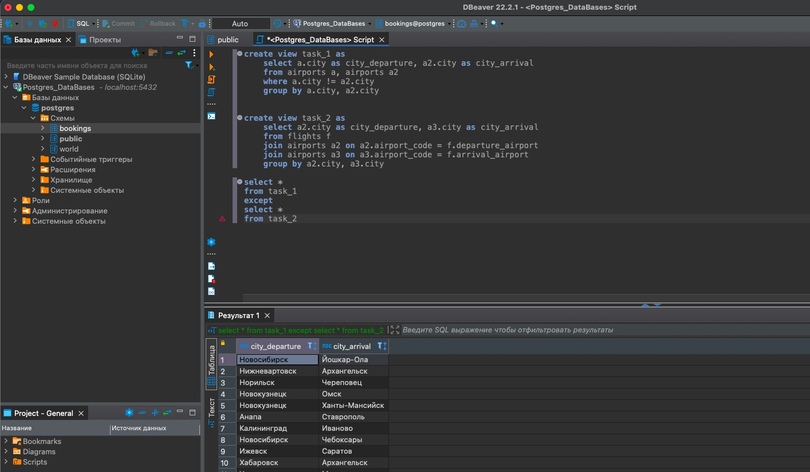

# **SQL**

### Инструменты:
- PostgreSQL
  - Subquery
  - JOIN
  - VIEW
  - PARTITION BY
  - CTE
  - EXCEPT

### Описание задачи:

1. Восстановить базу из *.backup файла по ссылке **[avia](https://drive.google.com/file/d/1U15gYuu_ZFE2sQMN32GXK3phBLcUl6OM/view)**. 
2. Перейти по **[ссылке](https://postgrespro.com/community/demodb)** и ознакомиться с описанием базы данных.
3. Создать запросы, позволяющие ответить на вопросы:

| №        | Вопрос           | В решении обязательно должно быть использовано  |
|-------------- |-------------|-----------------------------:|
|1|В каких городах больше одного аэропорта?||
|2|В каких аэропортах есть рейсы, выполняемые самолетом с максимальной дальностью перелета?|Подзапрос|
|3|Вывести 10 рейсов с максимальным временем задержки вылета.|Оператор LIMIT|
|4|Были ли брони, по которым не были получены посадочные талоны?|Верный тип JOIN|
|5|Найдите свободные места для каждого рейса, их % отношение к общему количеству мест в самолете. Добавьте столбец с накопительным итогом - суммарное накопление количества вывезенных пассажиров из каждого аэропорта на каждый день. Т.е. в этом столбце должна отражаться накопительная сумма - сколько человек уже вылетело из данного аэропорта на этом или более ранних рейсах за день.|Оконная функция, Подзапросы|
|6|Найдите процентное соотношение перелетов по типам самолетов от общего количества.|Подзапрос, Оператор ROUND|
|7|Были ли города, в которые можно  добраться бизнес - классом дешевле, чем эконом-классом в рамках перелета?|CTE|
|8|Между какими городами нет прямых рейсов?|Декартово произведение в предложении FROM, Самостоятельно созданные представления, Оператор EXCEPT|
|9|Вычислите расстояние между аэропортами, связанными прямыми рейсами, сравните с допустимой максимальной дальностью перелетов  в самолетах, обслуживающих эти рейсы *|Оператор RADIANS или использование sind/cosd|

\* В облачной базе координаты находятся в столбце airports_data.coordinates - работаете, как с массивом. В локальной базе координаты находятся в столбцах airports.longitude и airports.latitude.

Кратчайшее расстояние между двумя точками A и B на земной поверхности (если принять ее за сферу) определяется зависимостью:
d = arccos {sin(latitude_a)·sin(latitude_b) + cos(latitude_a)·cos(latitude_b)·cos(longitude_a - longitude_b)}, где latitude_a и latitude_b — широты, longitude_a, longitude_b — долготы данных пунктов, d — расстояние между пунктами измеряется в радианах длиной дуги большого круга земного шара.

Расстояние между пунктами, измеряемое в километрах, определяется по формуле:
L = d·R, где R = 6371 км — средний радиус земного шара.

### Решение:

1. **В каких городах больше одного аэропорта?**
   
     **Описание логики выполнения запроса:**
    - берем данные из таблицы airports;
    - группируем по названию города, в котором есть аэропорт;
    - фильтруем сгруппированные данные по условию "кол-во аэропортов" > 1;
    - выводим название городов, удовлетворяющих условию фильтрации.
    ```
    select a.city
    from airports a 
    group by a.city 
    having count(a.airport_name) > 1
    ```
    
2. **В каких аэропортах есть рейсы, выполняемые самолетом с максимальной дальностью перелета?**
    
    **Описание логики выполнения запроса:**
    - находим значение макс. дальности перелета из таблицы aircrafts (это 2-ой подзапрос);
    - находим код самолета, который имеет макс. дальность перелета (это 1 подзапрос);
    - выводим список кодов аэропортов (убрав дубли) из таблицы flights, где есть рейсы, выполняемые самолетом с максимальной дальностью перелета.
    ```
    select distinct f.departure_airport 
    from flights f 
    where f.aircraft_code = (
    				select a2.aircraft_code
    				from aircrafts a2 
    				where a2."range" = (select max(a."range") 
    								from aircrafts a
    								)
    				)
    ```		
    
3. **Вывести 10 рейсов с максимальным временем задержки вылета**
    
    **Описание логики выполнения запроса:**
    - считаем задержку по вылету каждого самолета;
    - фильтруем данные, где нет информации (задержка вылета = NULL) по задержке вылета;
    - сортируем данные по уменьшению задержки вылета;
    - выводим первые 10 id рейсов.
    ```
    select f.flight_id
    from flights f 
    where f.actual_departure - f.scheduled_departure is not null
    order by f.actual_departure - f.scheduled_departure desc
    limit 10
    ```
    
4. **Были ли брони, по которым не были получены посадочные талоны?**

    **Описание логики выполнения запроса:**
    - берем таблицу tickets, кот. содержит номера броней;
    - через left join объединяем с таблицей boarding_passes, кот. содержит номера броней и номера посадочных талонов;
    - полученные данные фильтруем по условию is null по столбцу с номером посадочного талона;
    - получаем список броней, по которым не были получены посадочные талоны.
    ```
    select distinct t.book_ref
    from tickets t 
    left join boarding_passes bp on t.ticket_no = bp.ticket_no 
    where bp.boarding_no is null
    ```
    
5. **Найдите свободные места для каждого рейса, их % отношение к общему количеству мест в самолете.**
**Добавьте столбец с накопительным итогом - суммарное накопление количества вывезенных пассажиров из каждого аэропорта на каждый день.**
**Т.е. в этом столбце должна отражаться накопительная сумма - сколько человек уже вылетело из данного аэропорта на этом или более ранних рейсах за день.**

    **Описание логики выполнения запроса:**
    - первым подзапросов from_bp считаем кол-во занятых мест для каждого перета;
    - вторым подзапросом from_seats считаем кол-во мест для каждой модели самолета;
    - объединяем данные по перелетам из таблицы flights с кол-ом занятых мест по каждому перелету и общим кол-вом посадочных мест самолета, кот. осущ. перелет;
    - убираем из полученных данных перелеты без пассажиров;
    - считаем процент свободным мест в рамках каждого перелета;
    - добавляем накопительный итог по кол-ву пассажиров, вывезенных из каждого аэропорта в день.
    ```
    select f.actual_departure, f.departure_airport, f.flight_id,
    		concat (round (cast (s2_count_seat_no - from_bp.bp_max as numeric) / cast (s2_count_seat_no as numeric) * 100, 2), '%') as free_seats,
    		sum (from_bp.bp_max) over (partition by f.departure_airport, date(f.actual_departure) order by f.actual_departure)
    from flights f
    join (
    	select bp.flight_id as bp_flight_id, max(bp.boarding_no) as bp_max
    	from boarding_passes bp 
    	group by bp.flight_id
    	) from_bp on from_bp.bp_flight_id = f.flight_id 
    join (
    	select s2.aircraft_code as s2_aircraft_code, count(s2.seat_no) as s2_count_seat_no
    	from seats s2 
    	group by s2.aircraft_code
    	) from_seats on from_seats.s2_aircraft_code = f.aircraft_code 
    where from_bp.bp_max > 0
    ```
    
6. **Найдите процентное соотношение перелетов по типам самолетов от общего количества.**

    **Описание логики выполнения запроса:**
    - вычисляем подзапросом общее количество перелетов count(f.flight_id) из таблицы flights;
    - группируем данные таблицы flights по aircraft_code и получаем кол-во перелетов для каждого типа самолета;
    - преобразуем значения общего кол-ва перелетов и перелетов для каждого типа самолета в numeric;
    - вычисляем процент перелетов по типам самолетов от общего количества перелетов с округлением до 2 знаков после запятой.
    ```
    select f.aircraft_code, concat (round (cast (count(f.flight_id) as numeric) / 
    										cast ((select count(f.flight_id) from flights f) as numeric) * 100, 2), ' %')
    from flights f 
    group by f.aircraft_code 
    ```
    
7. **Были ли города, в которые можно  добраться бизнес - классом дешевле, чем эконом-классом в рамках перелета?**

    **Описание логики выполнения запроса:**
    - в cte1 помещаем минимальную стоимость бизнес-класса для каждого перелета;
    - в cte2 помещаем максимальную стоимость эконом-класса для каждого перелета;
    - объединяем данные по макс./мин. стоимости бизнес/эконом класса (cte1 и cte2) с кодами аэропортов прилета (flights) и городами (airports);
    - выводим город аэропорта прилета (убрав через group by избыточность), где была ситуация, что макс. стоимость бизнес класса ниже мин. стоимости эконом класса.*/
    ```
    with cte1 as (
    	select tf.flight_id as business_flight_id, min(tf.amount) as min_business
    	from ticket_flights tf 
    	where tf.fare_conditions = 'Business'
    	group by tf.flight_id
    ),
    	cte2 as(
    	select tf.flight_id as economy_flight_id, max(tf.amount) as max_economy
    	from ticket_flights tf 
    	where tf.fare_conditions = 'Economy'
    	group by tf.flight_id
    )
    select a.city
    from cte1
    join cte2 on cte2.economy_flight_id = cte1.business_flight_id
    join flights f on f.flight_id = cte1.business_flight_id
    join airports a on a.airport_code = f.arrival_airport
    where cte1.min_business < cte2.max_economy
    group by a.city 
    ```
    
8. **Между какими городами нет прямых рейсов?**

    **Описание логики выполнения запроса:**
    - создаем представление task_1 в виде декартова произведения названий городов из таблицы airports;
    - объединяем таблицы перелетов (flights) и аэропортов (airports);
    - получаем город вылета и город прилета для каждого перелета и помещаем в представление task_2;
    - вычитаем из данных task_1 данные task_2;
    - получаем города, между которыми нет прямых рейсов.
    ```
    create view task_1 as
    	select a.city as city_departure, a2.city as city_arrival
    	from airports a, airports a2 
    	where a.city != a2.city
    	group by a.city, a2.city 
    create view task_2 as
    	select a2.city as city_departure, a3.city as city_arrival
    	from flights f 
    	join airports a2 on a2.airport_code = f.departure_airport
    	join airports a3 on a3.airport_code = f.arrival_airport 
    	group by a2.city, a3.city 
    select * 
    from task_1
    except
    select * 
    from task_2
    ```
    
9. **Вычислите расстояние между аэропортами, связанными прямыми рейсами, сравните с допустимой максимальной дальностью перелетов  в самолетах, обслуживающих эти рейсы**

    **Описание логики выполнения запроса:**
    - объединяем таблицы flights и airports, чтоб получить для каждого перелета координаты аэропортов вылета и прилета; 
    - объединяем таблицы flights и aircrafts, чтоб получить максимальную дальность самолета, который используется перелетов;
    - вычисляем по формуле расстояние между аэропортами;
    - вычисляем разницу между максимальной дальность самолета и расстоянием между аэропортами;
    - выводим названия аэропортов вылета/прилета, расстояние между аэропортами и резерв расстояния после перелета.
    ```
    select concat(a1.airport_name, ' – ', a2.airport_name) as airports, 
    		6371 * acos(sin(radians(a1.latitude)) * 
    		sin(radians(a2.latitude)) + 
    		cos(radians(a1.latitude)) * 
    		cos(radians(a2.latitude)) * 
    		cos(radians(a1.longitude) - 
    		radians(a2.longitude))) as distance,
    		a3."range" - 6371 * acos(sin(radians(a1.latitude)) * 
    						sin(radians(a2.latitude)) + 
    						cos(radians(a1.latitude)) * 
    						cos(radians(a2.latitude)) * 
    						cos(radians(a1.longitude) - 
    						radians(a2.longitude))) as reserves_distance
    from flights f 
    join airports a1 on a1.airport_code = f.departure_airport
    join airports a2 on a2.airport_code = f.arrival_airport 
    join aircrafts a3 on a3.aircraft_code = f.aircraft_code 
    group by airports, distance, reserves_distance
    ```
    